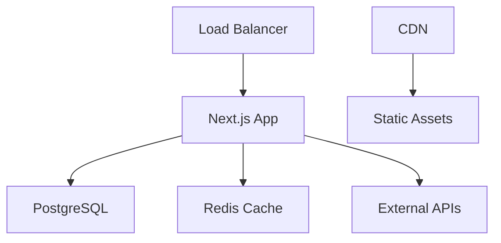

# SmartFin Technology Platform - Architecture Documentation

## Project Structure

```
smartfin-edu/
├── docs/                          # Project documentation
│   ├── ARCHITECTURE.md            # This file - architecture overview
│   └── PROJECT_STATUS.md          # Development status and progress
├── prisma/                        # Database schema and migrations
│   ├── schema.prisma              # Database schema definition
│   └── seed.ts                    # Database seeding scripts
├── public/                        # Static assets
│   └── assets/                    # Organized static files
├── scripts/                       # Development and deployment scripts
├── src/                           # Source code
│   ├── app/                       # Next.js App Router
│   │   ├── (auth)/               # Authentication routes (grouped)
│   │   ├── (dashboard)/          # Protected dashboard routes (grouped)
│   │   ├── api/                  # API routes
│   │   └── [public pages]/       # Public pages
│   ├── components/               # React components
│   │   ├── ui/                   # Base UI components (shadcn/ui)
│   │   ├── forms/                # Form components
│   │   ├── charts/               # Chart-related components
│   │   └── layout/               # Layout components
│   ├── hooks/                    # Custom React hooks
│   ├── lib/                      # Utility functions and configurations
│   │   ├── services/             # Business logic services
│   │   ├── clients/              # External service clients
│   │   ├── middleware/           # Custom middleware
│   │   └── config/               # Configuration files
│   └── types/                    # TypeScript type definitions
├── .env.example                  # Environment variables template
├── package.json                  # Dependencies and scripts
├── next.config.ts                # Next.js configuration
├── tailwind.config.ts            # Tailwind CSS configuration
├── tsconfig.json                 # TypeScript configuration
└── README.md                     # Project overview and setup
```

## Technology Stack

### Frontend
- **Framework**: Next.js 15 with App Router
- **Language**: TypeScript
- **Styling**: Tailwind CSS + shadcn/ui components
- **State Management**: Zustand + TanStack Query
- **Authentication**: NextAuth.js

### Backend
- **API Layer**: Next.js API Routes
- **Database**: PostgreSQL with Prisma ORM
- **Caching**: Redis
- **Authentication**: JWT + Session-based auth

### Infrastructure
- **Deployment**: Docker containers
- **CI/CD**: GitHub Actions
- **Monitoring**: Grafana + Prometheus
- **Email**: Nodemailer + SMTP

## Architecture Patterns

### 1. Route Groups
Using Next.js 13+ route groups to organize pages:
- `(auth)` - Authentication pages (login, register, reset)
- `(dashboard)` - Protected user dashboard pages

### 2. Service Layer Architecture
Business logic separated into service classes:
- `AuthService` - User authentication and authorization
- `MarketDataService` - Financial data operations
- `NotificationService` - Email and push notifications

### 3. Component Organization
Components organized by function:
- `ui/` - Reusable UI primitives
- `forms/` - Form-specific components
- `charts/` - Data visualization components
- `layout/` - Page layout components

### 4. Type Safety
Comprehensive TypeScript definitions:
- `auth.ts` - Authentication types
- `market.ts` - Financial data types
- `api.ts` - API request/response types

## Development Guidelines

### Code Organization
1. Group related functionality together
2. Use barrel exports for clean imports
3. Separate business logic from UI components
4. Implement proper error boundaries

### Performance Considerations
1. Use React.memo for expensive components
2. Implement proper caching strategies
3. Optimize database queries with Prisma
4. Use Next.js built-in optimizations

### Security Best Practices
1. Validate all user inputs
2. Implement proper authentication
3. Use HTTPS in production
4. Sanitize database queries
5. Implement rate limiting

## Deployment Architecture



## Environment Configuration

The application uses environment-specific configurations:
- Development: Local database and services
- Staging: Shared database with test data
- Production: Scaled infrastructure with monitoring