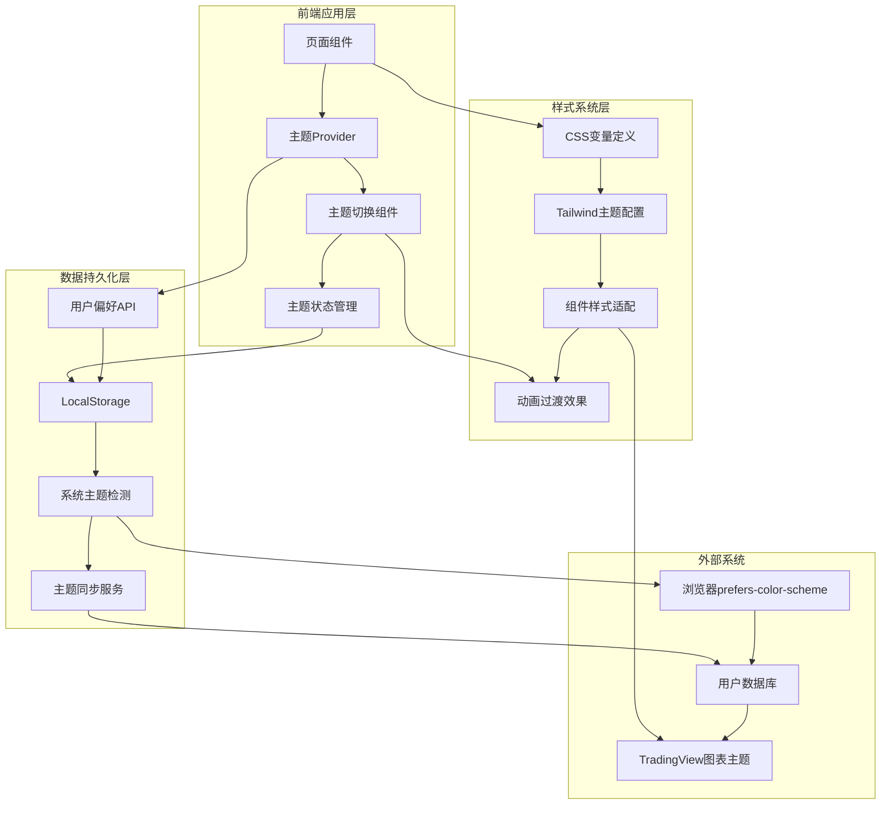

# 双主题系统技术设计方案

## 项目信息
- **功能模块**: 双主题系统技术设计
- **设计版本**: v1.0
- **技术栈**: Next.js 15 + Tailwind CSS + CSS Variables + TypeScript
- **设计日期**: 2025-01-26

## 1. 系统架构设计

### 1.1 整体架构图



### 1.2 技术架构分层

#### 表现层 (Presentation Layer)
- **主题切换UI组件**: 主题切换按钮、设置面板
- **主题状态指示器**: 当前主题显示、切换状态反馈
- **主题预览组件**: 实时主题效果预览

#### 业务逻辑层 (Business Logic Layer)
- **主题管理器**: 主题切换逻辑、状态管理
- **偏好同步服务**: 用户偏好保存、跨设备同步
- **主题检测服务**: 系统主题检测、自动切换

#### 数据访问层 (Data Access Layer)
- **本地存储管理**: localStorage/sessionStorage操作
- **用户偏好API**: 服务端用户设置存储
- **主题配置管理**: 主题色值、规则配置

#### 样式系统层 (Style System Layer)
- **CSS变量系统**: 主题色值定义、动态切换
- **Tailwind主题扩展**: 框架集成、工具类生成
- **组件样式适配**: 第三方组件主题覆盖

## 2. 数据模型设计

### 2.1 主题配置数据结构

#### 主题定义接口
```typescript
interface ThemeConfig {
    id: string;
    name: string;
    displayName: string;
    description: string;
    colors: ThemeColors;
    styles: ThemeStyles;
    meta: ThemeMeta;
}

interface ThemeColors {
    // 主要颜色
    primary: string;
    primaryHover: string;
    secondary: string;
    
    // 背景颜色
    background: string;
    surface: string;
    card: string;
    
    // 文字颜色
    textPrimary: string;
    textSecondary: string;
    textTertiary: string;
    
    // 状态颜色
    success: string;
    danger: string;
    warning: string;
    info: string;
    
    // 边框和分割线
    border: string;
    divider: string;
    
    // 图表特定颜色
    chartBackground: string;
    chartGrid: string;
    chartAxis: string;
    candleUp: string;
    candleDown: string;
}

interface ThemeStyles {
    shadows: {
        sm: string;
        md: string;
        lg: string;
        xl: string;
    };
    borderRadius: {
        sm: string;
        md: string;
        lg: string;
    };
    transitions: {
        fast: string;
        normal: string;
        slow: string;
    };
}

interface ThemeMeta {
    isDark: boolean;
    author: string;
    version: string;
    created: string;
    updated: string;
}
```

#### 用户主题偏好数据结构
```typescript
interface UserThemePreference {
    userId?: string;
    currentTheme: string;
    autoSwitch: boolean;
    autoSwitchTimes?: {
        lightStart: string; // "06:00"
        darkStart: string;  // "18:00"
    };
    followSystem: boolean;
    customThemes?: string[];
    lastModified: string;
}

interface ThemeState {
    currentTheme: ThemeConfig;
    availableThemes: ThemeConfig[];
    isLoading: boolean;
    preference: UserThemePreference;
    systemPreference: 'light' | 'dark' | null;
}
```

### 2.2 数据库设计

#### 用户主题设置表
```sql
CREATE TABLE user_theme_preferences (
    id UUID PRIMARY KEY DEFAULT gen_random_uuid(),
    user_id UUID REFERENCES users(id) ON DELETE CASCADE,
    theme_id VARCHAR(50) NOT NULL DEFAULT 'light',
    auto_switch BOOLEAN DEFAULT FALSE,
    light_start_time TIME DEFAULT '06:00:00',
    dark_start_time TIME DEFAULT '18:00:00',
    follow_system BOOLEAN DEFAULT TRUE,
    custom_settings JSONB DEFAULT '{}',
    created_at TIMESTAMP WITH TIME ZONE DEFAULT CURRENT_TIMESTAMP,
    updated_at TIMESTAMP WITH TIME ZONE DEFAULT CURRENT_TIMESTAMP,
    
    UNIQUE(user_id)
);

-- 索引优化
CREATE INDEX idx_user_theme_preferences_user_id ON user_theme_preferences(user_id);
CREATE INDEX idx_user_theme_preferences_theme_id ON user_theme_preferences(theme_id);
```

#### 全局主题配置表
```sql
CREATE TABLE theme_configurations (
    id VARCHAR(50) PRIMARY KEY,
    name VARCHAR(100) NOT NULL,
    display_name VARCHAR(100) NOT NULL,
    description TEXT,
    color_scheme JSONB NOT NULL,
    style_config JSONB DEFAULT '{}',
    is_active BOOLEAN DEFAULT TRUE,
    is_default BOOLEAN DEFAULT FALSE,
    sort_order INTEGER DEFAULT 0,
    created_at TIMESTAMP WITH TIME ZONE DEFAULT CURRENT_TIMESTAMP,
    updated_at TIMESTAMP WITH TIME ZONE DEFAULT CURRENT_TIMESTAMP
);

-- 初始主题数据
INSERT INTO theme_configurations (id, name, display_name, description, color_scheme, is_default) VALUES
('light', 'professional-light', '专业白色主题', '适合日间办公和正式场合的专业主题', '{
    "primary": "#003366",
    "primaryHover": "#004080",
    "secondary": "#0066CC",
    "background": "#FFFFFF",
    "surface": "#F8F9FA",
    "card": "#FFFFFF",
    "textPrimary": "#111827",
    "textSecondary": "#6B7280",
    "textTertiary": "#9CA3AF",
    "success": "#00AA44",
    "danger": "#DD3333",
    "warning": "#F59E0B",
    "info": "#3B82F6",
    "border": "#E5E7EB",
    "divider": "#F3F4F6"
}', TRUE),
('dark', 'professional-dark', '专业黑色主题', '适合长时间工作和夜间使用的护眼主题', '{
    "primary": "#0066CC",
    "primaryHover": "#0080FF",
    "secondary": "#0099FF",
    "background": "#0A0A0A",
    "surface": "#1A1A1A",
    "card": "#2A2A2A",
    "textPrimary": "#FFFFFF",
    "textSecondary": "#D1D5DB",
    "textTertiary": "#9CA3AF",
    "success": "#00DD88",
    "danger": "#FF4444",
    "warning": "#FBBF24",
    "info": "#60A5FA",
    "border": "#374151",
    "divider": "#4B5563"
}', FALSE);
```

## 3. 核心服务设计

### 3.1 主题管理服务

#### 主题管理器类
```typescript
// lib/theme/ThemeManager.ts
export class ThemeManager {
    private static instance: ThemeManager;
    private themes: Map<string, ThemeConfig> = new Map();
    private currentTheme: ThemeConfig | null = null;
    private preference: UserThemePreference | null = null;
    private listeners: Set<(theme: ThemeConfig) => void> = new Set();
    
    static getInstance(): ThemeManager {
        if (!ThemeManager.instance) {
            ThemeManager.instance = new ThemeManager();
        }
        return ThemeManager.instance;
    }
    
    async initialize(): Promise<void> {
        // 加载主题配置
        await this.loadThemes();
        
        // 检测系统主题偏好
        const systemPreference = this.detectSystemPreference();
        
        // 加载用户偏好
        const userPreference = await this.loadUserPreference();
        
        // 确定初始主题
        const initialTheme = this.determineInitialTheme(systemPreference, userPreference);
        
        // 应用主题
        await this.setTheme(initialTheme);
        
        // 设置系统主题监听
        this.setupSystemThemeListener();
        
        // 设置自动切换
        if (userPreference?.autoSwitch) {
            this.setupAutoSwitch(userPreference.autoSwitchTimes!);
        }
    }
    
    private async loadThemes(): Promise<void> {
        try {
            // 从API加载主题配置
            const response = await fetch('/api/themes');
            const themes: ThemeConfig[] = await response.json();
            
            themes.forEach(theme => {
                this.themes.set(theme.id, theme);
            });
        } catch (error) {
            console.error('Failed to load themes:', error);
            // 使用默认主题配置
            this.loadDefaultThemes();
        }
    }
    
    private loadDefaultThemes(): void {
        const lightTheme: ThemeConfig = {
            id: 'light',
            name: 'professional-light',
            displayName: '专业白色主题',
            description: '适合日间办公和正式场合',
            colors: {
                primary: '#003366',
                primaryHover: '#004080',
                secondary: '#0066CC',
                background: '#FFFFFF',
                surface: '#F8F9FA',
                card: '#FFFFFF',
                textPrimary: '#111827',
                textSecondary: '#6B7280',
                textTertiary: '#9CA3AF',
                success: '#00AA44',
                danger: '#DD3333',
                warning: '#F59E0B',
                info: '#3B82F6',
                border: '#E5E7EB',
                divider: '#F3F4F6',
                chartBackground: '#FFFFFF',
                chartGrid: '#F3F4F6',
                chartAxis: '#6B7280',
                candleUp: '#00AA44',
                candleDown: '#DD3333'
            },
            styles: {
                shadows: {
                    sm: '0 1px 2px 0 rgb(0 0 0 / 0.05)',
                    md: '0 4px 6px -1px rgb(0 0 0 / 0.1)',
                    lg: '0 10px 15px -3px rgb(0 0 0 / 0.1)',
                    xl: '0 20px 25px -5px rgb(0 0 0 / 0.1)'
                },
                borderRadius: {
                    sm: '0.125rem',
                    md: '0.375rem',
                    lg: '0.5rem'
                },
                transitions: {
                    fast: 'all 0.15s ease',
                    normal: 'all 0.2s ease',
                    slow: 'all 0.3s ease'
                }
            },
            meta: {
                isDark: false,
                author: 'SmartFin Team',
                version: '1.0.0',
                created: '2025-01-26',
                updated: '2025-01-26'
            }
        };
        
        const darkTheme: ThemeConfig = {
            ...lightTheme,
            id: 'dark',
            name: 'professional-dark',
            displayName: '专业黑色主题',
            description: '适合长时间工作和夜间使用',
            colors: {
                primary: '#0066CC',
                primaryHover: '#0080FF',
                secondary: '#0099FF',
                background: '#0A0A0A',
                surface: '#1A1A1A',
                card: '#2A2A2A',
                textPrimary: '#FFFFFF',
                textSecondary: '#D1D5DB',
                textTertiary: '#9CA3AF',
                success: '#00DD88',
                danger: '#FF4444',
                warning: '#FBBF24',
                info: '#60A5FA',
                border: '#374151',
                divider: '#4B5563',
                chartBackground: '#1A1A1A',
                chartGrid: '#374151',
                chartAxis: '#9CA3AF',
                candleUp: '#00DD88',
                candleDown: '#FF4444'
            },
            meta: {
                ...lightTheme.meta,
                isDark: true
            }
        };
        
        this.themes.set('light', lightTheme);
        this.themes.set('dark', darkTheme);
    }
    
    async setTheme(themeId: string, savePreference = true): Promise<void> {
        const theme = this.themes.get(themeId);
        if (!theme) {
            throw new Error(`Theme '${themeId}' not found`);
        }
        
        this.currentTheme = theme;
        
        // 应用CSS变量
        this.applyCSSVariables(theme);
        
        // 更新HTML类名
        this.updateHTMLClass(theme);
        
        // 通知监听器
        this.notifyListeners(theme);
        
        // 保存用户偏好
        if (savePreference) {
            await this.saveUserPreference(themeId);
        }
        
        // 更新第三方组件主题
        this.updateThirdPartyThemes(theme);
    }
    
    private applyCSSVariables(theme: ThemeConfig): void {
        const root = document.documentElement;
        
        // 应用颜色变量
        Object.entries(theme.colors).forEach(([key, value]) => {
            const cssVarName = `--color-${key.replace(/([A-Z])/g, '-$1').toLowerCase()}`;
            root.style.setProperty(cssVarName, value);
        });
        
        // 应用样式变量
        Object.entries(theme.styles.shadows).forEach(([key, value]) => {
            root.style.setProperty(`--shadow-${key}`, value);
        });
        
        Object.entries(theme.styles.borderRadius).forEach(([key, value]) => {
            root.style.setProperty(`--radius-${key}`, value);
        });
        
        Object.entries(theme.styles.transitions).forEach(([key, value]) => {
            root.style.setProperty(`--transition-${key}`, value);
        });
    }
    
    private updateHTMLClass(theme: ThemeConfig): void {
        const html = document.documentElement;
        
        // 移除所有主题类
        html.classList.remove('theme-light', 'theme-dark');
        
        // 添加当前主题类
        html.classList.add(`theme-${theme.id}`);
        
        // 添加dark模式类（用于兼容第三方组件）
        if (theme.meta.isDark) {
            html.classList.add('dark');
        } else {
            html.classList.remove('dark');
        }
    }
    
    private detectSystemPreference(): 'light' | 'dark' | null {
        if (typeof window === 'undefined') return null;
        
        if (window.matchMedia && window.matchMedia('(prefers-color-scheme: dark)').matches) {
            return 'dark';
        } else if (window.matchMedia && window.matchMedia('(prefers-color-scheme: light)').matches) {
            return 'light';
        }
        
        return null;
    }
    
    private setupSystemThemeListener(): void {
        if (typeof window === 'undefined') return;
        
        const darkModeQuery = window.matchMedia('(prefers-color-scheme: dark)');
        
        darkModeQuery.addEventListener('change', (e) => {
            if (this.preference?.followSystem) {
                const newTheme = e.matches ? 'dark' : 'light';
                this.setTheme(newTheme, false);
            }
        });
    }
    
    private async loadUserPreference(): Promise<UserThemePreference | null> {
        try {
            // 尝试从服务器加载（已登录用户）
            const response = await fetch('/api/user/theme-preference');
            if (response.ok) {
                return await response.json();
            }
        } catch (error) {
            console.warn('Failed to load user preference from server:', error);
        }
        
        // 从localStorage加载
        const stored = localStorage.getItem('theme-preference');
        if (stored) {
            try {
                return JSON.parse(stored);
            } catch (error) {
                console.warn('Failed to parse stored theme preference:', error);
            }
        }
        
        return null;
    }
    
    private async saveUserPreference(themeId: string): Promise<void> {
        const preference: UserThemePreference = {
            currentTheme: themeId,
            autoSwitch: this.preference?.autoSwitch || false,
            autoSwitchTimes: this.preference?.autoSwitchTimes,
            followSystem: this.preference?.followSystem || false,
            lastModified: new Date().toISOString()
        };
        
        this.preference = preference;
        
        // 保存到localStorage
        localStorage.setItem('theme-preference', JSON.stringify(preference));
        
        // 尝试保存到服务器（已登录用户）
        try {
            await fetch('/api/user/theme-preference', {
                method: 'POST',
                headers: { 'Content-Type': 'application/json' },
                body: JSON.stringify(preference)
            });
        } catch (error) {
            console.warn('Failed to save preference to server:', error);
        }
    }
    
    private determineInitialTheme(
        systemPreference: 'light' | 'dark' | null,
        userPreference: UserThemePreference | null
    ): string {
        // 用户手动设置的主题优先
        if (userPreference?.currentTheme && !userPreference.followSystem) {
            return userPreference.currentTheme;
        }
        
        // 跟随系统主题
        if (userPreference?.followSystem && systemPreference) {
            return systemPreference;
        }
        
        // 使用用户保存的主题
        if (userPreference?.currentTheme) {
            return userPreference.currentTheme;
        }
        
        // 使用系统主题
        if (systemPreference) {
            return systemPreference;
        }
        
        // 默认主题
        return 'light';
    }
    
    subscribe(listener: (theme: ThemeConfig) => void): () => void {
        this.listeners.add(listener);
        return () => {
            this.listeners.delete(listener);
        };
    }
    
    private notifyListeners(theme: ThemeConfig): void {
        this.listeners.forEach(listener => {
            try {
                listener(theme);
            } catch (error) {
                console.error('Theme listener error:', error);
            }
        });
    }
    
    getCurrentTheme(): ThemeConfig | null {
        return this.currentTheme;
    }
    
    getAvailableThemes(): ThemeConfig[] {
        return Array.from(this.themes.values());
    }
    
    private updateThirdPartyThemes(theme: ThemeConfig): void {
        // 更新TradingView图表主题
        if (typeof window !== 'undefined' && (window as any).TradingView) {
            const tradingViewTheme = theme.meta.isDark ? 'dark' : 'light';
            // 通知所有TradingView图表实例更新主题
            window.dispatchEvent(new CustomEvent('tradingview-theme-change', {
                detail: { theme: tradingViewTheme }
            }));
        }
    }
    
    private setupAutoSwitch(times: { lightStart: string; darkStart: string }): void {
        const checkTime = () => {
            const now = new Date();
            const currentTime = `${now.getHours().toString().padStart(2, '0')}:${now.getMinutes().toString().padStart(2, '0')}`;
            
            const lightStart = times.lightStart;
            const darkStart = times.darkStart;
            
            let shouldBeDark: boolean;
            
            if (darkStart < lightStart) {
                // 跨午夜的情况，如 18:00 - 06:00
                shouldBeDark = currentTime >= darkStart || currentTime < lightStart;
            } else {
                // 正常情况，如 06:00 - 18:00
                shouldBeDark = currentTime >= darkStart && currentTime < lightStart;
            }
            
            const targetTheme = shouldBeDark ? 'dark' : 'light';
            
            if (this.currentTheme?.id !== targetTheme) {
                this.setTheme(targetTheme, false);
            }
        };
        
        // 立即检查一次
        checkTime();
        
        // 每分钟检查一次
        setInterval(checkTime, 60000);
    }
}
```

### 3.2 主题状态管理（Zustand）

#### 主题Store
```typescript
// stores/themeStore.ts
import { create } from 'zustand';
import { ThemeManager } from '@/lib/theme/ThemeManager';

interface ThemeStore {
    currentTheme: ThemeConfig | null;
    availableThemes: ThemeConfig[];
    isLoading: boolean;
    preference: UserThemePreference | null;
    
    // Actions
    initialize: () => Promise<void>;
    setTheme: (themeId: string) => Promise<void>;
    toggleTheme: () => Promise<void>;
    updatePreference: (preference: Partial<UserThemePreference>) => Promise<void>;
    
    // Computed
    isDarkMode: () => boolean;
    getThemeById: (id: string) => ThemeConfig | undefined;
}

export const useThemeStore = create<ThemeStore>((set, get) => {
    const themeManager = ThemeManager.getInstance();
    
    // 订阅主题变化
    themeManager.subscribe((theme) => {
        set({ currentTheme: theme });
    });
    
    return {
        currentTheme: null,
        availableThemes: [],
        isLoading: false,
        preference: null,
        
        initialize: async () => {
            set({ isLoading: true });
            try {
                await themeManager.initialize();
                set({
                    currentTheme: themeManager.getCurrentTheme(),
                    availableThemes: themeManager.getAvailableThemes(),
                    isLoading: false
                });
            } catch (error) {
                console.error('Theme initialization failed:', error);
                set({ isLoading: false });
            }
        },
        
        setTheme: async (themeId: string) => {
            try {
                await themeManager.setTheme(themeId);
            } catch (error) {
                console.error('Failed to set theme:', error);
                throw error;
            }
        },
        
        toggleTheme: async () => {
            const { currentTheme } = get();
            if (!currentTheme) return;
            
            const newThemeId = currentTheme.id === 'light' ? 'dark' : 'light';
            await get().setTheme(newThemeId);
        },
        
        updatePreference: async (preference: Partial<UserThemePreference>) => {
            // 更新偏好逻辑
            const current = get().preference || {} as UserThemePreference;
            const updated = { ...current, ...preference };
            
            try {
                const response = await fetch('/api/user/theme-preference', {
                    method: 'PUT',
                    headers: { 'Content-Type': 'application/json' },
                    body: JSON.stringify(updated)
                });
                
                if (response.ok) {
                    set({ preference: updated });
                    localStorage.setItem('theme-preference', JSON.stringify(updated));
                }
            } catch (error) {
                console.error('Failed to update preference:', error);
                throw error;
            }
        },
        
        isDarkMode: () => {
            return get().currentTheme?.meta.isDark || false;
        },
        
        getThemeById: (id: string) => {
            return get().availableThemes.find(theme => theme.id === id);
        }
    };
});
```

## 4. 前端组件设计

### 4.1 主题切换组件

#### 主题切换按钮
```typescript
// components/theme/ThemeToggle.tsx
import React from 'react';
import { useThemeStore } from '@/stores/themeStore';
import { SunIcon, MoonIcon } from '@heroicons/react/24/outline';

interface ThemeToggleProps {
    variant?: 'button' | 'switch' | 'dropdown';
    size?: 'sm' | 'md' | 'lg';
    showLabel?: boolean;
    className?: string;
}

export const ThemeToggle: React.FC<ThemeToggleProps> = ({
    variant = 'button',
    size = 'md',
    showLabel = false,
    className = ''
}) => {
    const { currentTheme, toggleTheme, isLoading } = useThemeStore();
    
    const isDark = currentTheme?.meta.isDark || false;
    
    const handleToggle = async () => {
        try {
            await toggleTheme();
        } catch (error) {
            console.error('Theme toggle failed:', error);
        }
    };
    
    if (variant === 'switch') {
        return (
            <label className={`theme-switch ${className}`}>
                <input
                    type="checkbox"
                    checked={isDark}
                    onChange={handleToggle}
                    disabled={isLoading}
                    className="sr-only"
                />
                <div className={`switch-track ${size}`}>
                    <div className={`switch-thumb ${isDark ? 'translate-x-6' : 'translate-x-1'}`}>
                        {isDark ? (
                            <MoonIcon className="w-4 h-4 text-blue-600" />
                        ) : (
                            <SunIcon className="w-4 h-4 text-yellow-500" />
                        )}
                    </div>
                </div>
                {showLabel && (
                    <span className="ml-2 text-sm font-medium">
                        {isDark ? '黑色主题' : '白色主题'}
                    </span>
                )}
            </label>
        );
    }
    
    return (
        <button
            onClick={handleToggle}
            disabled={isLoading}
            className={`theme-toggle-btn ${size} ${className}`}
            aria-label={`切换到${isDark ? '白色' : '黑色'}主题`}
            title={`切换到${isDark ? '白色' : '黑色'}主题`}
        >
            <div className="toggle-icon-container">
                <SunIcon className={`toggle-icon sun ${!isDark ? 'active' : ''}`} />
                <MoonIcon className={`toggle-icon moon ${isDark ? 'active' : ''}`} />
            </div>
            
            {showLabel && (
                <span className="toggle-label">
                    {isDark ? '黑色主题' : '白色主题'}
                </span>
            )}
            
            {isLoading && (
                <div className="toggle-loading">
                    <div className="loading-spinner" />
                </div>
            )}
        </button>
    );
};
```

#### 主题设置面板
```typescript
// components/theme/ThemeSettingsPanel.tsx
import React, { useState } from 'react';
import { useThemeStore } from '@/stores/themeStore';
import { Switch, Select, TimePicker } from '@/components/ui';

interface ThemeSettingsPanelProps {
    isOpen: boolean;
    onClose: () => void;
}

export const ThemeSettingsPanel: React.FC<ThemeSettingsPanelProps> = ({
    isOpen,
    onClose
}) => {
    const {
        currentTheme,
        availableThemes,
        preference,
        setTheme,
        updatePreference
    } = useThemeStore();
    
    const [localPreference, setLocalPreference] = useState(preference);
    
    const handleThemeChange = async (themeId: string) => {
        await setTheme(themeId);
    };
    
    const handlePreferenceChange = (key: keyof UserThemePreference, value: any) => {
        const updated = { ...localPreference, [key]: value };
        setLocalPreference(updated);
    };
    
    const handleSave = async () => {
        try {
            await updatePreference(localPreference);
            onClose();
        } catch (error) {
            console.error('Failed to save preferences:', error);
        }
    };
    
    if (!isOpen) return null;
    
    return (
        <div className="theme-settings-panel">
            <div className="panel-header">
                <h3 className="panel-title">主题设置</h3>
                <button onClick={onClose} className="close-button">
                    ×
                </button>
            </div>
            
            <div className="panel-content">
                {/* 主题选择 */}
                <div className="setting-group">
                    <label className="setting-label">选择主题</label>
                    <div className="theme-options">
                        {availableThemes.map(theme => (
                            <button
                                key={theme.id}
                                onClick={() => handleThemeChange(theme.id)}
                                className={`theme-option ${currentTheme?.id === theme.id ? 'active' : ''}`}
                            >
                                <div 
                                    className="theme-preview"
                                    style={{
                                        backgroundColor: theme.colors.background,
                                        color: theme.colors.textPrimary,
                                        border: `1px solid ${theme.colors.border}`
                                    }}
                                >
                                    <div className="preview-header" style={{ backgroundColor: theme.colors.primary }} />
                                    <div className="preview-content">
                                        <div className="preview-text" />
                                        <div className="preview-text short" />
                                    </div>
                                </div>
                                <span className="theme-name">{theme.displayName}</span>
                            </button>
                        ))}
                    </div>
                </div>
                
                {/* 跟随系统 */}
                <div className="setting-group">
                    <div className="setting-row">
                        <label className="setting-label">跟随系统主题</label>
                        <Switch
                            checked={localPreference?.followSystem || false}
                            onChange={(checked) => handlePreferenceChange('followSystem', checked)}
                        />
                    </div>
                    <p className="setting-description">
                        自动根据系统的明暗模式设置切换主题
                    </p>
                </div>
                
                {/* 自动切换 */}
                <div className="setting-group">
                    <div className="setting-row">
                        <label className="setting-label">定时自动切换</label>
                        <Switch
                            checked={localPreference?.autoSwitch || false}
                            onChange={(checked) => handlePreferenceChange('autoSwitch', checked)}
                            disabled={localPreference?.followSystem}
                        />
                    </div>
                    
                    {localPreference?.autoSwitch && (
                        <div className="auto-switch-times">
                            <div className="time-setting">
                                <label>白色主题开始时间</label>
                                <TimePicker
                                    value={localPreference?.autoSwitchTimes?.lightStart || '06:00'}
                                    onChange={(time) => handlePreferenceChange('autoSwitchTimes', {
                                        ...localPreference?.autoSwitchTimes,
                                        lightStart: time
                                    })}
                                />
                            </div>
                            <div className="time-setting">
                                <label>黑色主题开始时间</label>
                                <TimePicker
                                    value={localPreference?.autoSwitchTimes?.darkStart || '18:00'}
                                    onChange={(time) => handlePreferenceChange('autoSwitchTimes', {
                                        ...localPreference?.autoSwitchTimes,
                                        darkStart: time
                                    })}
                                />
                            </div>
                        </div>
                    )}
                </div>
            </div>
            
            <div className="panel-footer">
                <button onClick={onClose} className="btn-secondary">
                    取消
                </button>
                <button onClick={handleSave} className="btn-primary">
                    保存设置
                </button>
            </div>
        </div>
    );
};
```

### 4.2 主题上下文提供者

#### 主题Provider组件
```typescript
// components/theme/ThemeProvider.tsx
import React, { useEffect, createContext, useContext } from 'react';
import { useThemeStore } from '@/stores/themeStore';

interface ThemeContextValue {
    theme: ThemeConfig | null;
    setTheme: (themeId: string) => Promise<void>;
    toggleTheme: () => Promise<void>;
    isDark: boolean;
    isLoading: boolean;
}

const ThemeContext = createContext<ThemeContextValue | null>(null);

export const useTheme = () => {
    const context = useContext(ThemeContext);
    if (!context) {
        throw new Error('useTheme must be used within ThemeProvider');
    }
    return context;
};

interface ThemeProviderProps {
    children: React.ReactNode;
}

export const ThemeProvider: React.FC<ThemeProviderProps> = ({ children }) => {
    const {
        currentTheme,
        isLoading,
        initialize,
        setTheme,
        toggleTheme,
        isDarkMode
    } = useThemeStore();
    
    useEffect(() => {
        initialize();
    }, [initialize]);
    
    // SSR支持：防止主题闪烁
    useEffect(() => {
        if (typeof window !== 'undefined' && currentTheme) {
            // 移除SSR预设的类
            document.documentElement.classList.remove('theme-loading');
        }
    }, [currentTheme]);
    
    const contextValue: ThemeContextValue = {
        theme: currentTheme,
        setTheme,
        toggleTheme,
        isDark: isDarkMode(),
        isLoading
    };
    
    return (
        <ThemeContext.Provider value={contextValue}>
            {children}
        </ThemeContext.Provider>
    );
};
```

## 5. 样式系统设计

### 5.1 CSS变量定义

#### 全局CSS变量文件
```css
/* styles/themes/variables.css */

/* 默认主题变量（Light主题） */
:root {
    /* 主要颜色 */
    --color-primary: #003366;
    --color-primary-hover: #004080;
    --color-secondary: #0066CC;
    
    /* 背景颜色 */
    --color-background: #FFFFFF;
    --color-surface: #F8F9FA;
    --color-card: #FFFFFF;
    
    /* 文字颜色 */
    --color-text-primary: #111827;
    --color-text-secondary: #6B7280;
    --color-text-tertiary: #9CA3AF;
    
    /* 状态颜色 */
    --color-success: #00AA44;
    --color-danger: #DD3333;
    --color-warning: #F59E0B;
    --color-info: #3B82F6;
    
    /* 边框和分割线 */
    --color-border: #E5E7EB;
    --color-divider: #F3F4F6;
    
    /* 图表颜色 */
    --color-chart-background: #FFFFFF;
    --color-chart-grid: #F3F4F6;
    --color-chart-axis: #6B7280;
    --color-candle-up: #00AA44;
    --color-candle-down: #DD3333;
    
    /* 阴影 */
    --shadow-sm: 0 1px 2px 0 rgb(0 0 0 / 0.05);
    --shadow-md: 0 4px 6px -1px rgb(0 0 0 / 0.1);
    --shadow-lg: 0 10px 15px -3px rgb(0 0 0 / 0.1);
    --shadow-xl: 0 20px 25px -5px rgb(0 0 0 / 0.1);
    
    /* 边框圆角 */
    --radius-sm: 0.125rem;
    --radius-md: 0.375rem;
    --radius-lg: 0.5rem;
    
    /* 过渡动画 */
    --transition-fast: all 0.15s ease;
    --transition-normal: all 0.2s ease;
    --transition-slow: all 0.3s ease;
}

/* Dark主题变量覆盖 */
.theme-dark {
    /* 主要颜色 */
    --color-primary: #0066CC;
    --color-primary-hover: #0080FF;
    --color-secondary: #0099FF;
    
    /* 背景颜色 */
    --color-background: #0A0A0A;
    --color-surface: #1A1A1A;
    --color-card: #2A2A2A;
    
    /* 文字颜色 */
    --color-text-primary: #FFFFFF;
    --color-text-secondary: #D1D5DB;
    --color-text-tertiary: #9CA3AF;
    
    /* 状态颜色 */
    --color-success: #00DD88;
    --color-danger: #FF4444;
    --color-warning: #FBBF24;
    --color-info: #60A5FA;
    
    /* 边框和分割线 */
    --color-border: #374151;
    --color-divider: #4B5563;
    
    /* 图表颜色 */
    --color-chart-background: #1A1A1A;
    --color-chart-grid: #374151;
    --color-chart-axis: #9CA3AF;
    --color-candle-up: #00DD88;
    --color-candle-down: #FF4444;
    
    /* 阴影（深色主题下的阴影） */
    --shadow-sm: 0 1px 2px 0 rgb(0 0 0 / 0.3);
    --shadow-md: 0 4px 6px -1px rgb(0 0 0 / 0.4);
    --shadow-lg: 0 10px 15px -3px rgb(0 0 0 / 0.4);
    --shadow-xl: 0 20px 25px -5px rgb(0 0 0 / 0.5);
}

/* 主题过渡动画 */
.theme-transition {
    transition: var(--transition-normal);
}

/* 应用主题过渡到所有相关元素 */
*,
*::before,
*::after {
    transition: background-color var(--transition-normal),
                border-color var(--transition-normal),
                color var(--transition-normal),
                fill var(--transition-normal),
                stroke var(--transition-normal);
}

/* SSR防闪烁 */
.theme-loading * {
    transition: none !important;
}
```

### 5.2 Tailwind CSS配置扩展

#### Tailwind主题配置
```javascript
// tailwind.config.js
const plugin = require('tailwindcss/plugin');

module.exports = {
    content: [
        './src/**/*.{js,ts,jsx,tsx}',
        './pages/**/*.{js,ts,jsx,tsx}',
        './components/**/*.{js,ts,jsx,tsx}'
    ],
    darkMode: 'class', // 使用class策略
    theme: {
        extend: {
            colors: {
                // 语义化颜色名称
                primary: {
                    DEFAULT: 'var(--color-primary)',
                    hover: 'var(--color-primary-hover)'
                },
                secondary: 'var(--color-secondary)',
                
                background: 'var(--color-background)',
                surface: 'var(--color-surface)',
                card: 'var(--color-card)',
                
                text: {
                    primary: 'var(--color-text-primary)',
                    secondary: 'var(--color-text-secondary)',
                    tertiary: 'var(--color-text-tertiary)'
                },
                
                success: 'var(--color-success)',
                danger: 'var(--color-danger)',
                warning: 'var(--color-warning)',
                info: 'var(--color-info)',
                
                border: 'var(--color-border)',
                divider: 'var(--color-divider)',
                
                // 图表专用颜色
                chart: {
                    background: 'var(--color-chart-background)',
                    grid: 'var(--color-chart-grid)',
                    axis: 'var(--color-chart-axis)',
                    up: 'var(--color-candle-up)',
                    down: 'var(--color-candle-down)'
                }
            },
            
            boxShadow: {
                'theme-sm': 'var(--shadow-sm)',
                'theme-md': 'var(--shadow-md)',
                'theme-lg': 'var(--shadow-lg)',
                'theme-xl': 'var(--shadow-xl)'
            },
            
            borderRadius: {
                'theme-sm': 'var(--radius-sm)',
                'theme-md': 'var(--radius-md)',
                'theme-lg': 'var(--radius-lg)'
            },
            
            transitionDuration: {
                'theme-fast': '150ms',
                'theme-normal': '200ms',
                'theme-slow': '300ms'
            }
        }
    },
    plugins: [
        // 自定义主题插件
        plugin(function({ addUtilities, addComponents, theme }) {
            // 主题相关工具类
            addUtilities({
                '.theme-transition': {
                    transition: 'var(--transition-normal)'
                }
            });
            
            // 主题相关组件类
            addComponents({
                '.theme-card': {
                    backgroundColor: 'var(--color-card)',
                    border: '1px solid var(--color-border)',
                    borderRadius: 'var(--radius-md)',
                    boxShadow: 'var(--shadow-sm)'
                },
                
                '.theme-button': {
                    backgroundColor: 'var(--color-primary)',
                    color: 'var(--color-background)',
                    borderRadius: 'var(--radius-md)',
                    transition: 'var(--transition-fast)',
                    '&:hover': {
                        backgroundColor: 'var(--color-primary-hover)'
                    }
                },
                
                '.theme-input': {
                    backgroundColor: 'var(--color-surface)',
                    border: '1px solid var(--color-border)',
                    color: 'var(--color-text-primary)',
                    borderRadius: 'var(--radius-sm)',
                    '&:focus': {
                        borderColor: 'var(--color-primary)',
                        outline: 'none',
                        boxShadow: '0 0 0 2px var(--color-primary)'
                    }
                }
            });
        })
    ]
};
```

### 5.3 组件样式模块

#### 主题切换组件样式
```css
/* styles/components/theme-toggle.css */

.theme-toggle-btn {
    @apply relative inline-flex items-center justify-center;
    @apply bg-surface border border-border rounded-theme-md;
    @apply text-text-primary hover:bg-card;
    @apply transition-all duration-theme-fast;
    @apply focus:outline-none focus:ring-2 focus:ring-primary focus:ring-opacity-50;
}

.theme-toggle-btn.sm {
    @apply w-8 h-8 text-sm;
}

.theme-toggle-btn.md {
    @apply w-10 h-10 text-base;
}

.theme-toggle-btn.lg {
    @apply w-12 h-12 text-lg;
}

.theme-toggle-btn:disabled {
    @apply opacity-50 cursor-not-allowed;
}

.toggle-icon-container {
    @apply relative w-5 h-5;
}

.toggle-icon {
    @apply absolute inset-0 w-full h-full;
    @apply transition-all duration-theme-normal;
    @apply transform;
}

.toggle-icon.sun {
    @apply text-yellow-500;
    @apply opacity-0 scale-50 rotate-180;
}

.toggle-icon.sun.active {
    @apply opacity-100 scale-100 rotate-0;
}

.toggle-icon.moon {
    @apply text-blue-400;
    @apply opacity-0 scale-50 rotate-180;
}

.toggle-icon.moon.active {
    @apply opacity-100 scale-100 rotate-0;
}

.toggle-label {
    @apply ml-2 text-sm font-medium text-text-secondary;
}

.toggle-loading {
    @apply absolute inset-0 flex items-center justify-center;
    @apply bg-surface bg-opacity-80 rounded-theme-md;
}

.loading-spinner {
    @apply w-4 h-4 border-2 border-primary border-t-transparent;
    @apply rounded-full animate-spin;
}

/* 主题切换开关样式 */
.theme-switch {
    @apply inline-flex items-center cursor-pointer;
}

.switch-track {
    @apply relative flex items-center;
    @apply bg-surface border-2 border-border rounded-full;
    @apply transition-colors duration-theme-normal;
}

.switch-track.sm {
    @apply w-11 h-6;
}

.switch-track.md {
    @apply w-14 h-7;
}

.switch-track.lg {
    @apply w-16 h-8;
}

.switch-thumb {
    @apply absolute left-0 flex items-center justify-center;
    @apply bg-background border border-border rounded-full;
    @apply transition-transform duration-theme-normal;
    @apply shadow-theme-sm;
}

.switch-track.sm .switch-thumb {
    @apply w-5 h-5;
}

.switch-track.md .switch-thumb {
    @apply w-6 h-6;
}

.switch-track.lg .switch-thumb {
    @apply w-7 h-7;
}

/* Dark模式下的开关样式调整 */
.theme-dark .switch-track {
    @apply bg-surface border-divider;
}

.theme-dark .switch-thumb {
    @apply bg-card border-border;
}
```

## 6. API接口设计

### 6.1 主题相关API端点

#### 获取用户主题偏好
```typescript
// pages/api/user/theme-preference.ts
import { NextApiRequest, NextApiResponse } from 'next';
import { getServerSession } from 'next-auth';
import { authOptions } from '@/pages/api/auth/[...nextauth]';
import { getUserThemePreference } from '@/lib/services/themeService';

export default async function handler(
    req: NextApiRequest,
    res: NextApiResponse
) {
    if (req.method === 'GET') {
        try {
            const session = await getServerSession(req, res, authOptions);
            
            if (!session?.user?.id) {
                return res.status(401).json({
                    success: false,
                    error: { code: 'UNAUTHORIZED', message: '请先登录' }
                });
            }
            
            const preference = await getUserThemePreference(session.user.id);
            
            return res.status(200).json({
                success: true,
                data: preference
            });
            
        } catch (error) {
            console.error('Get theme preference error:', error);
            return res.status(500).json({
                success: false,
                error: { code: 'INTERNAL_ERROR', message: '服务器内部错误' }
            });
        }
    }
    
    if (req.method === 'POST' || req.method === 'PUT') {
        try {
            const session = await getServerSession(req, res, authOptions);
            
            if (!session?.user?.id) {
                return res.status(401).json({
                    success: false,
                    error: { code: 'UNAUTHORIZED', message: '请先登录' }
                });
            }
            
            const preferenceData = req.body;
            
            // 验证数据
            if (!preferenceData.currentTheme) {
                return res.status(400).json({
                    success: false,
                    error: { code: 'VALIDATION_ERROR', message: '缺少主题设置' }
                });
            }
            
            const preference = await saveUserThemePreference(
                session.user.id,
                preferenceData
            );
            
            return res.status(200).json({
                success: true,
                data: preference
            });
            
        } catch (error) {
            console.error('Save theme preference error:', error);
            return res.status(500).json({
                success: false,
                error: { code: 'INTERNAL_ERROR', message: '保存失败' }
            });
        }
    }
    
    return res.status(405).json({
        success: false,
        error: { code: 'METHOD_NOT_ALLOWED', message: '不支持的请求方法' }
    });
}
```

#### 获取主题配置列表
```typescript
// pages/api/themes/index.ts
import { NextApiRequest, NextApiResponse } from 'next';
import { getThemeConfigurations } from '@/lib/services/themeService';

export default async function handler(
    req: NextApiRequest,
    res: NextApiResponse
) {
    if (req.method === 'GET') {
        try {
            const themes = await getThemeConfigurations();
            
            return res.status(200).json({
                success: true,
                data: themes
            });
            
        } catch (error) {
            console.error('Get themes error:', error);
            return res.status(500).json({
                success: false,
                error: { code: 'INTERNAL_ERROR', message: '获取主题配置失败' }
            });
        }
    }
    
    return res.status(405).json({
        success: false,
        error: { code: 'METHOD_NOT_ALLOWED', message: '不支持的请求方法' }
    });
}
```

## 7. SSR和性能优化

### 7.1 服务端渲染支持

#### 主题预渲染脚本
```typescript
// lib/theme/ssrSupport.ts

// 内联脚本，防止主题闪烁
export const getThemeScript = () => {
    return `
        (function() {
            function getStoredTheme() {
                try {
                    const stored = localStorage.getItem('theme-preference');
                    if (stored) {
                        const preference = JSON.parse(stored);
                        return preference.currentTheme;
                    }
                } catch (e) {
                    console.warn('Failed to parse stored theme preference');
                }
                return null;
            }
            
            function getSystemTheme() {
                if (window.matchMedia && window.matchMedia('(prefers-color-scheme: dark)').matches) {
                    return 'dark';
                }
                return 'light';
            }
            
            function applyTheme(themeId) {
                const html = document.documentElement;
                
                // 移除所有主题类
                html.classList.remove('theme-light', 'theme-dark');
                
                // 添加当前主题类
                html.classList.add('theme-' + themeId);
                
                // 添加或移除dark类
                if (themeId === 'dark') {
                    html.classList.add('dark');
                } else {
                    html.classList.remove('dark');
                }
            }
            
            // 确定初始主题
            const storedTheme = getStoredTheme();
            const systemTheme = getSystemTheme();
            const initialTheme = storedTheme || systemTheme || 'light';
            
            // 立即应用主题
            applyTheme(initialTheme);
            
            // 移除加载类（防止闪烁）
            setTimeout(() => {
                document.documentElement.classList.remove('theme-loading');
            }, 100);
        })();
    `;
};

// 在_document.tsx中使用
export const injectThemeScript = () => {
    return (
        <script
            dangerouslySetInnerHTML={{
                __html: getThemeScript()
            }}
        />
    );
};
```

#### Next.js文档组件
```typescript
// pages/_document.tsx
import { Html, Head, Main, NextScript } from 'next/document';
import { injectThemeScript } from '@/lib/theme/ssrSupport';

export default function Document() {
    return (
        <Html className="theme-loading">
            <Head>
                {/* 预加载主题CSS */}
                <link 
                    rel="preload" 
                    href="/css/themes.css" 
                    as="style"
                />
                <link 
                    rel="stylesheet" 
                    href="/css/themes.css"
                />
            </Head>
            <body>
                {/* 防闪烁脚本 - 必须在body开始处 */}
                {injectThemeScript()}
                
                <Main />
                <NextScript />
            </body>
        </Html>
    );
}
```

### 7.2 性能优化策略

#### CSS优化
```css
/* 关键路径CSS内联 */
<style>
    .theme-loading * {
        transition: none !important;
    }
    
    :root {
        --color-primary: #003366;
        --color-background: #FFFFFF;
        --color-text-primary: #111827;
    }
    
    .theme-dark {
        --color-primary: #0066CC;
        --color-background: #0A0A0A;
        --color-text-primary: #FFFFFF;
    }
</style>
```

#### 懒加载和代码分割
```typescript
// 动态导入主题设置面板
const ThemeSettingsPanel = lazy(() => 
    import('@/components/theme/ThemeSettingsPanel')
);

// 使用Suspense包装
const ThemeSettings = () => {
    const [showSettings, setShowSettings] = useState(false);
    
    return (
        <>
            <button onClick={() => setShowSettings(true)}>
                主题设置
            </button>
            
            {showSettings && (
                <Suspense fallback={<div>加载中...</div>}>
                    <ThemeSettingsPanel 
                        isOpen={showSettings}
                        onClose={() => setShowSettings(false)}
                    />
                </Suspense>
            )}
        </>
    );
};
```

---

**文档版本**: v1.0  
**创建日期**: 2025-01-26  
**最后更新**: 2025-01-26  
**审核状态**: 待审核  
**下一步**: 开发任务分解